# INSS Chatbot

O **INSS Chatbot** é um assistente virtual inteligente desenvolvido para democratizar o acesso às informações sobre aposentadoria do INSS. Utilizando técnicas de Inteligência Artificial, especificamente RAG (Retrieval-Augmented Generation), o chatbot fornece respostas sobre direitos previdenciários, baseando-se em informações oficiais extraídas diretamente do site do Governo Federal.

## Chatbot Engine
Este repositório contém as configurações e códigos para criar a *engine* que recebe, e responde a, perguntas referentes a aposentadoria. Para isso este repositório comtempla dois módulos do projeto:

* **Módulo de Extração de Conteúdo**: responsável pelo pipeline de extração e processamento de dados que serão utilizados no contexto passado ao modelo;

* **Módulo de RAG**: é o componente de inteligência artificial responsável por gerar respostas sobre aposentadoria do INSS. Ele combina busca vetorial semântica com um modelo de linguagem (LLM) para recuperar informações relevantes da base de conhecimento e transformá-las em respostas contextualizadas.

## Estrutura do Repositório

```
.
├── database/
│   ├── creating_vector_endpoint.py      # Criação do endpoint de busca vetorial
│   └── inss_data_tables_ddls.py         # DDLs das tabelas do banco de dados
│
├── rag/
│   ├── create_model_chain.py            # Registro da aplicação RAG no mlflow
│   └── rag_chain.py                     # Definição da chain utilizada no modelo
│   └── constants.py                     # Definição de constantes utilizadas nos dois arquivos
│
├── scrapper/
│   ├── scrapper_inss_site_to_raw.py     # Extração inicial dos dados do site INSS e registro desses dados na tabela raw
│   ├── raw_inss_site_data_to_consolidated_table.py  # Registro dos dados extraídos em uma tabela consolidada
│   └── update_vector_database.py        # Atualização da base vetorial
│
└── README.md
```

## Bases de Dados

### Tabelas Principais

| Tabela | Descrição |
|--------|-----------|
| `raw_inss_crawled_data.direitos_aposentadoria` | Dados brutos históricos das extrações |
| `inss_crawled_data.direitos_aposentadoria` | Dados consolidados mais recentes |
| `direitos_aposentadoria_index` | Índice vetorizado para busca semântica |

### Estrutura das Tabelas

| Campo | Tipo | Descrição |
|-------|------|-----------|
| `retirement_type` | string | Tipo de aposentadoria (Rural, Urbana, etc.) |
| `page_url` | string | URL da página extraída |
| `html_page_content` | string | Conteúdo HTML extraído |
| `scraped_at` | timestamp | Data/hora da extração |
| `last_update_on_inss_site` | timestamp | Data da última atualização no site do INSS |


## Como Executar

### Pré-requisitos
- Acesso ao Databricks

### Configuração Inicial

1.  **Adicione seu repositório do GitHub ao Databricks:** siga os passos a seguir para associar o repositório do GitHub ao Databricks, dessa forma você conseguirá acessar os arquivos diretamente de dentro da plataforma:

    1.1 Dentro do espaço de *Workspace* busque por *Repo*:
    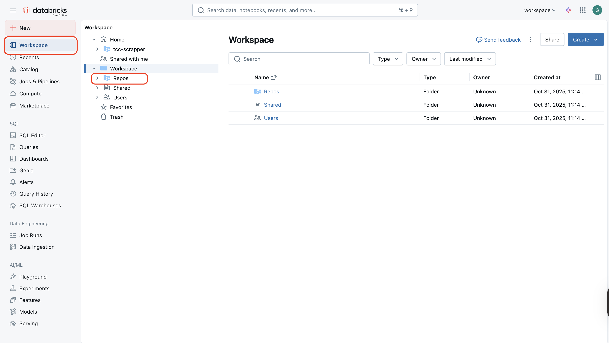

    1.2 Clique em *Create* e em *Git folder*:
    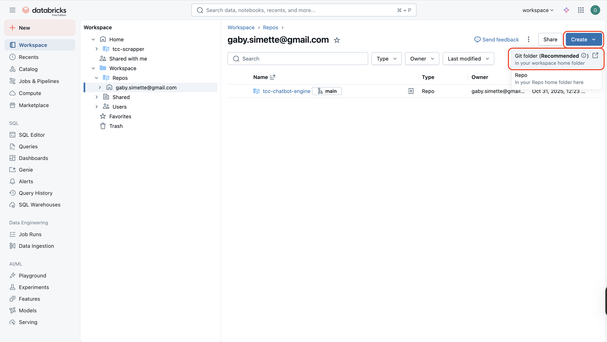

    1.3 Adicione as informações do repositório para conectar o repositório ao Databricks:
    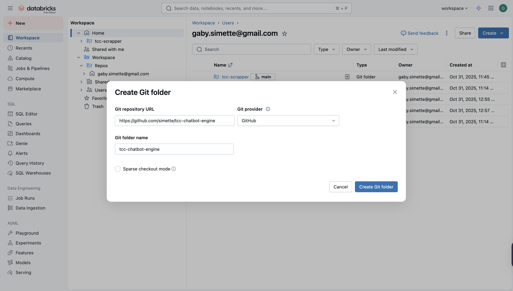

2. **Criar as tabelas do banco de dados:** execute o arquivo `database/inss_data_tables_ddls.py` para criar as tabelas para receber os dados extraídos;

3. **Criar o endpoint de busca vetorial:** execute o arquivo `database/creating_vector_endpoint.py` para criar a base de dados vetorial e o endpoint para acesso aos dados;

4. **Configurar a execução do scrapper:** crie um novo *job* no Databricks. Para isso siga as instruções a seguir:

    4.1 Crie um novo *job* dentro da plataforma:
    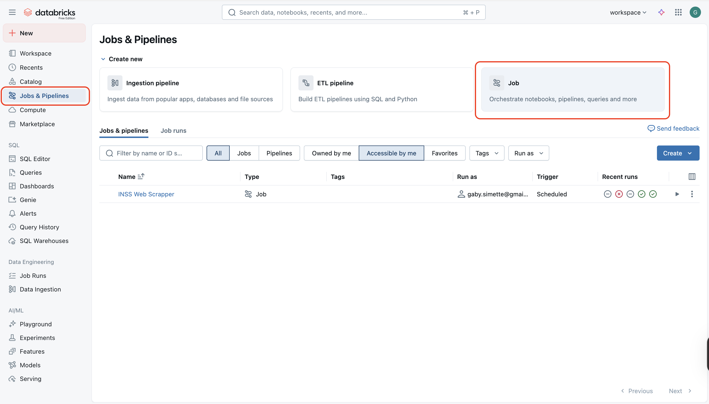

    4.2 Crie a primeira *task* do job e selecione o formato do arquivo do *scrapper*:
    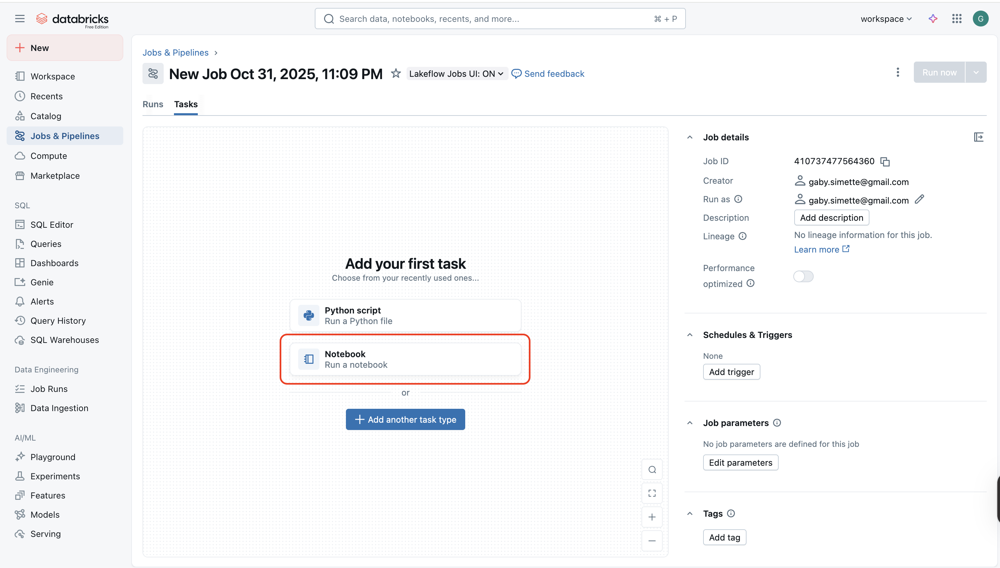

    4.3 Selecione o arquivo `scrapper/scrapper_inss_site_to_raw.py` para a primeira *task* a ser executada no processo:
    

    4.4 Adicione uma nova *task* que será responsável pela atualização da tabela consolidada:
    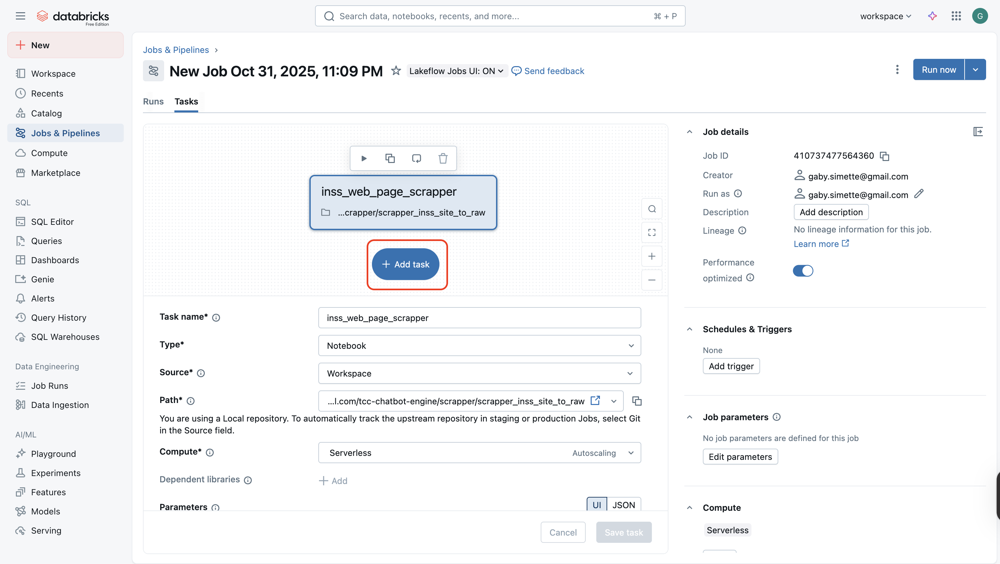

    4.5 Selecione o arquivo `scrapper/raw_inss_site_data_to_consolidated_table.py`:
    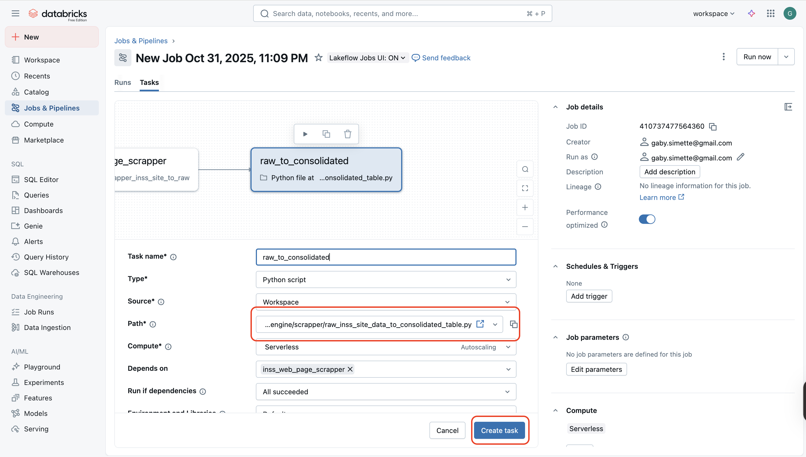

    4.6 Adicione uma nova *task* que será responsável pela atualização da tabela vetorizada:
    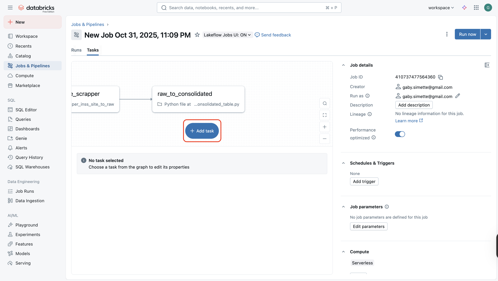

    4.7 Selecione o arquivo scrapper/update_vector_database.py:
    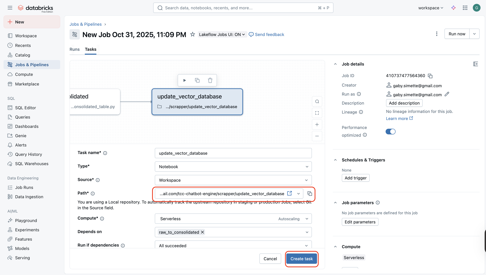

    4.8 O *pipeline* de execução deve ficar da seguinte forma:
    

    4.9 E por fim é possível ajustar o agendamento de execução da task atrávez da opção *Add Trigger*:
    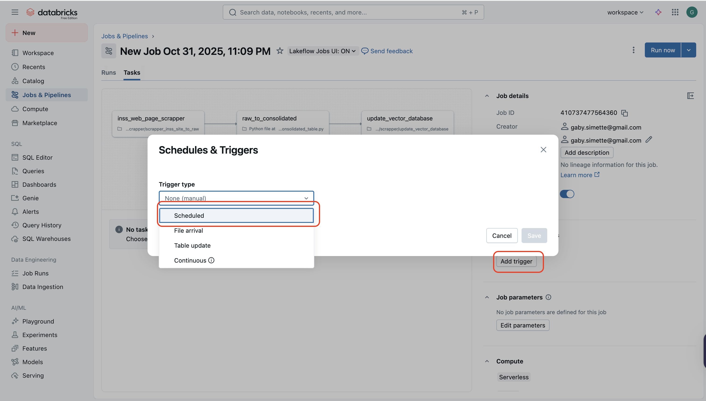

    4.10 Para testar a execução de forma manual, basta utilizar a opção *Run now*:
    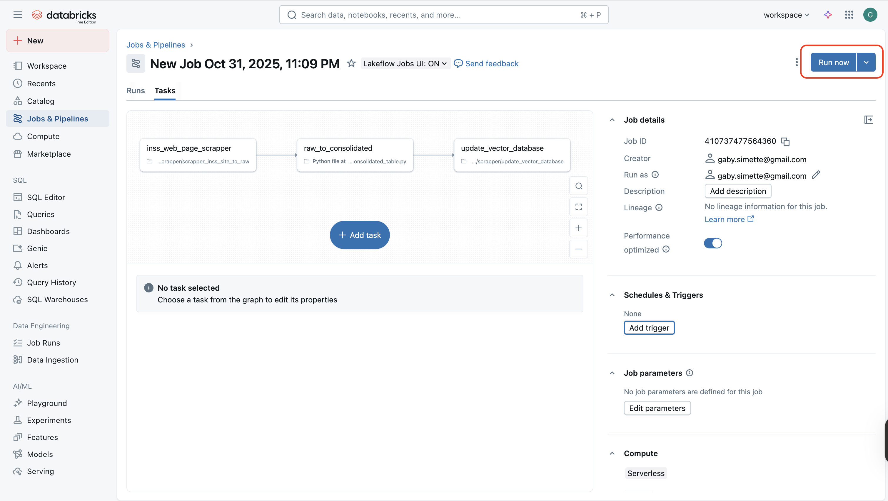